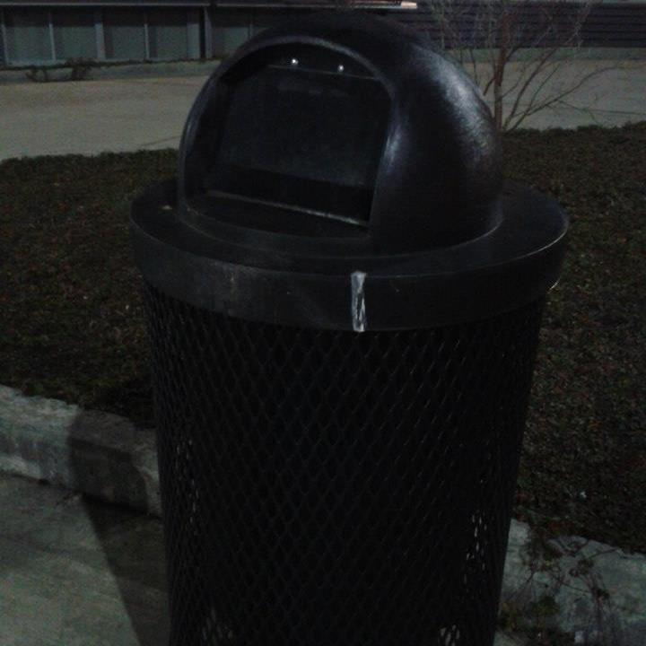

##`Alissa`
### `Chartographer, Reporter`

 &nbsp;&nbsp;&nbsp;&nbsp;&nbsp;&nbsp; An accomplished holder of a high school ~~diploma~~ equivalency certificate,
 &nbsp;&nbsp;&nbsp;&nbsp;&nbsp;&nbsp; Madam Adornato aspires one day to become the first human being to use 
 &nbsp;&nbsp;&nbsp;&nbsp;&nbsp;&nbsp; every type of restroom in the world. She considers professional wrestler 
 
&nbsp;&nbsp;&nbsp;&nbsp;&nbsp;&nbsp; Kenneth Omega and singer turned professional plastic surgeonee Pete  &nbsp;&nbsp;&nbsp;&nbsp;&nbsp;&nbsp; Burns to be her idols. The latter, in particular, inspired her to create the 
 &nbsp;&nbsp;&nbsp;&nbsp;&nbsp;&nbsp; stunning visuals present in our map. 
  
  
  
  
  
  
  
  

##`Althea`
### `Shiny efficianado, #aesthetic considerer`

 &nbsp;&nbsp;&nbsp;&nbsp;&nbsp;&nbsp; I consider my great accomplishment to be the time I photoshopped my
  &nbsp;&nbsp;&nbsp;&nbsp;&nbsp;&nbsp; favorite professional wrestlers into a modern day retelling of a biblical  &nbsp;&nbsp;&nbsp;&nbsp;&nbsp;&nbsp; visual. Does that make me a hipster? Does using the word #aesthetic? I don't &nbsp;&nbsp;&nbsp;&nbsp;&nbsp;&nbsp;  know, you tell me. Get back to me. 
  
  
  
  
  
  
  
  
  

##`Albert`
### `Researcher Body man`

 &nbsp;&nbsp;&nbsp;&nbsp;&nbsp;&nbsp; What is a body man, you ask?
 
 
 &nbsp;&nbsp;&nbsp;&nbsp;&nbsp;&nbsp; ...Let's hope you never have to find out.
  
  
  
  
  
  
  
  

##`Echo`
### `Goddess of (the) Time(line), Problem Solver/Solution Finder`

 &nbsp;&nbsp;&nbsp;&nbsp;&nbsp;&nbsp; Echo Echo &nbsp;&nbsp;&nbsp;&nbsp;&nbsp;&nbsp;  Echo
 &nbsp;&nbsp;&nbsp;&nbsp;&nbsp;&nbsp; &nbsp;&nbsp;&nbsp;&nbsp;&nbsp;&nbsp; Echo &nbsp;&nbsp;&nbsp;&nbsp;&nbsp;&nbsp; &nbsp;&nbsp;&nbsp;&nbsp;&nbsp;&nbsp; &nbsp;&nbsp;&nbsp;&nbsp;&nbsp;&nbsp; Echo
 
 
 
 
  
  
  
  
  
  
  

